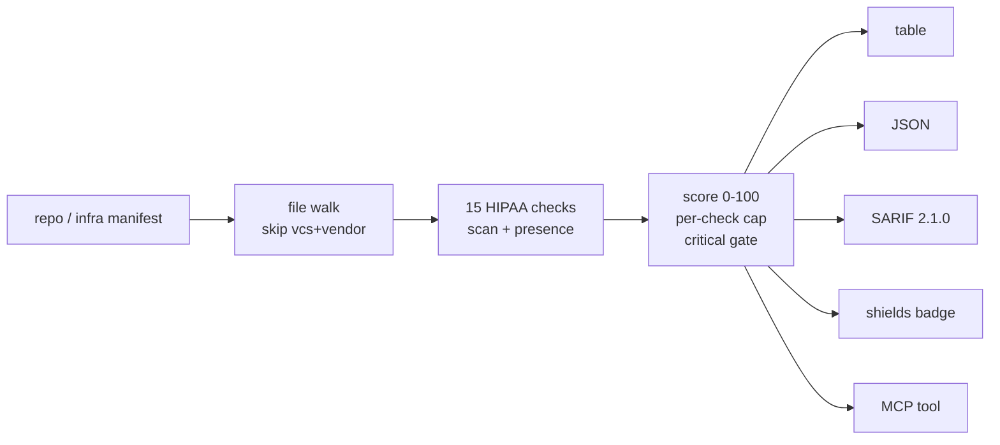

<a name="top"></a>
<div align="center">


# BAADIFF

### Scan a repo or infra manifest for HIPAA Security Rule gaps and produce a Business Associate readiness scorecard.


[](https://pypi.org/project/cognis-baadiff/) [](https://github.com/cognis-digital/baadiff/actions) [](LICENSE) [](https://github.com/cognis-digital)

*Healthcare & Life-Sciences — HIPAA, PHI, FHIR/HL7, and clinical data.*

</div>

```bash
pip install cognis-baadiff
baadiff scan .            # → prioritized findings in seconds
```

## Usage — step by step

`baadiff` scans a repo or manifest for HIPAA Security Rule gaps and scores compliance.

1. **Install**:
   ```bash
   pip install -e .
   ```
2. **Scan a file or directory**:
   ```bash
   baadiff scan ./my-service
   ```
3. **Set a passing threshold** (score out of 100) and disable color for logs:
   ```bash
   baadiff scan ./my-service --threshold 90 --no-color
   ```
4. **Read the output** as JSON, and emit a status badge:
   ```bash
   baadiff scan ./my-service --format json --badge hipaa-badge.svg
   ```
5. **Automate in CI** — the scan exits non-zero when the score is below `--threshold`:
   ```bash
   baadiff scan . --threshold 80 --format json
   ```

## Contents

- [Why baadiff?](#why) · [What it checks](#checks) · [Features](#features) · [Quick start](#quick-start) · [Example](#example) · [Scope & safety](#scope) · [Architecture](#architecture) · [AI stack](#ai-stack) · [How it compares](#how-it-compares) · [Integrations](#integrations) · [Install anywhere](#install-anywhere) · [Related](#related) · [Contributing](#contributing)

<a name="why"></a>
## Why baadiff?

A SOC-2-style 'are we HIPAA-shippable?' scanner that outputs a shareable badge — startups slap it on their README to signal compliance maturity.

`baadiff` is single-purpose, scriptable, and self-hostable: point it at a target, get prioritized results in the format your workflow already speaks (table · JSON · SARIF), gate CI on it, and let agents drive it over MCP.

<div align="right"><a href="#top">↑ back to top</a></div>

<a name="checks"></a>
## What it checks

Every check is an **evidence-based proxy** for a HIPAA Security Rule safeguard
(45 CFR §164.308 administrative, §164.310 physical, §164.312 technical). A check
either finds a positive control marker (something is configured) or flags a risk
marker (a plaintext secret, an unencrypted protocol, an over-broad permission).

| ID | Safeguard | Detects |
|---|---|---|
| BD001 | §164.312(a)(2)(i) | Hardcoded secret / credential (skips env refs + placeholders + comments) |
| BD002 | §164.312(e)(1) | Plaintext `http://` (non-localhost) or disabled TLS verification |
| BD003 | §164.312(c)(1) | Weak hash (MD5/SHA1) used on ePHI |
| BD004 | §164.312(a)(1) | Wildcard IAM `*` or `0.0.0.0/0` ingress (config files only) |
| BD005 | §164.312(a)(2)(iv) | *presence* — encryption at rest |
| BD006 | §164.312(b) | *presence* — audit controls / logging |
| BD007 | §164.312(d) | *presence* — authentication / access control |
| BD008 | §164.308(a)(7) | *presence* — backup / contingency |
| BD009 | §164.312(c)(2) | *presence* — integrity verification (SHA-256/HMAC) |
| BD010 | §164.308(a)(1)(ii)(B) | Debug mode left enabled in deployable config |
| BD011 | §164.312(a)(2)(iv) | Encryption explicitly **disabled** |
| BD012 | §164.312(a)(1) | World-readable / public object storage |
| BD013 | §164.312(b) | Raw PHI (SSN-shaped value) written to logs |
| BD014 | §164.312(a)(2)(iii) | *presence* — automatic logoff / session timeout |
| BD015 | §164.308(a)(7)(ii) | *presence* — contingency / data-retention policy |

**Scoring.** Each failing finding deducts points by severity
(critical 18 · high 10 · medium 5 · low 2), capped at 30 per check id so one
noisy file can't dominate. `score = max(0, 100 − Σ deductions)`; the grade is
A≥90 / B≥80 / C≥70 / D≥60 / F. A target is **shippable** only when the score
meets `--threshold` (default 80) **and** there are zero open critical findings.

<div align="right"><a href="#top">↑ back to top</a></div>

<a name="features"></a>
## Features

- ✅ **15 evidence-based checks** mapped to real HIPAA Security Rule citations (45 CFR §164.308/.310/.312) — secrets, plaintext transport, weak crypto, wildcard IAM, public buckets, PHI-in-logs, debug mode, plus presence checks for encryption-at-rest, audit logging, authentication, backup, integrity, auto-logoff, and retention.
- ✅ **0–100 readiness score + letter grade** with a per-check cap (no single noisy file tanks the score) and a hard rule: an open **critical** finding can never be `shippable`.
- ✅ **Output your pipeline already speaks** — colorized table, machine `--format json`, and **SARIF 2.1.0** (`--format sarif`) for GitHub code-scanning.
- ✅ **Shareable badge** — `--badge badge.json` writes a shields.io endpoint so you can pin "HIPAA readiness 92/100 (A)" to your README.
- ✅ **CI gate** — exits non-zero when the score is below `--threshold` (default 80), so a regression fails the build.
- ✅ **MCP-native** — `baadiff mcp` exposes `scan()` to Claude Desktop, Cursor, and Cognis.Studio.
- ✅ **Passive & offline** — reads local files only; no network, no active scanning, safe to run in an air-gapped CI runner.
- ✅ Runs on Linux/macOS/Windows · Docker · devcontainer.
- ✅ **Polyglot ports** in Python (reference), JavaScript/Node, Go, Rust, and POSIX shell (`ports/`) — all share rule IDs and JSON shape.

<div align="right"><a href="#top">↑ back to top</a></div>

<a name="quick-start"></a>
## Quick start

```bash
pip install cognis-baadiff
baadiff --version
baadiff scan .                           # scan current project (table)
baadiff scan . --format json             # machine-readable scorecard
baadiff scan . --format sarif > out.sarif  # GitHub code-scanning
baadiff scan . --threshold 90            # tighten the CI gate
baadiff scan . --badge badge.json        # write a shields.io badge
```

`scan` exits **non-zero** when the score is below `--threshold` (default 80) or
any open **critical** finding exists — drop it straight into CI.

<div align="right"><a href="#top">↑ back to top</a></div>

<a name="example"></a>
## Example

Scan the bundled demo service (intentionally flawed — secrets, plaintext HTTP, a
disabled TLS check, a weak hash, and missing controls):

```text
$ baadiff scan demos/01-basic/patient_service.py

  BAADIFF — HIPAA Security Rule Readiness
  --------------------------------------------------------
  GAPS:
   CRITICAL [BD001 164.312(a)(2)(i)] patient_service.py:18
            Hardcoded credential/secret detected (ePHI access controls require managed secrets, not plaintext).
   HIGH     [BD002 164.312(e)(1)] patient_service.py:22
            Plaintext http:// endpoint -- transmission security (164.312(e)(1)) expects encryption in transit (TLS).
   HIGH     [BD002 164.312(e)(1)] patient_service.py:35
            TLS verification disabled -- defeats transmission security / integrity controls.
   HIGH     [BD005 164.312(a)(2)(iv)] (corpus)
            No evidence of this safeguard anywhere in the scanned sources.
   MEDIUM   [BD003 164.312(c)(1)] patient_service.py:38
            Weak hash (MD5/SHA1) -- not acceptable for protecting or authenticating ePHI integrity.
   ... (audit logging, backup, auto-logoff, retention also missing)

  CONTROLS SATISFIED:
   PASS [BD007 164.312(d)]   Authentication / access control present
   PASS [BD009 164.312(c)(2)] Integrity verification (hashing/HMAC) present
  --------------------------------------------------------
  SCORE: 25/100  grade F
  STATUS: NOT SHIPPABLE   (2 controls, 9 gaps)

  Note: static best-effort signal, not legal advice.
```

The same scan as JSON (each finding carries its `check_id`, HIPAA `safeguard`,
`severity`, `file`, and `line`):

```jsonc
$ baadiff scan demos/01-basic/patient_service.py --format json
{
  "score": 25,
  "grade": "F",
  "shippable": false,
  "total_checks": 15,
  "failed": 9,
  "passed": 2,
  "by_severity": { "critical": 1, "high": 3, "medium": 3, "low": 1 },
  "findings": [
    {
      "check_id": "BD001",
      "title": "No hardcoded secrets / credentials",
      "safeguard": "164.312(a)(2)(i)",
      "severity": "critical",
      "status": "fail",
      "message": "Hardcoded credential/secret detected ...",
      "file": "patient_service.py",
      "line": 18
    }
    /* ... */
  ]
}
```

Clean up the file (move the secret to `os.environ`, switch to `https://`, drop
`verify=False`, replace `md5` with `sha256`, add audit logging + a backup note)
and the score climbs past the threshold and `shippable` flips to `true`.

<div align="right"><a href="#top">↑ back to top</a></div>

<a name="scope"></a>
## Scope, authorization & safety

- **Defensive, read-only, passive.** `baadiff` only **reads** files you point it
  at. It performs **no active scanning**, opens no sockets, sends no traffic, and
  runs no exploit or auth-bypass logic. Run it on code and infra **you own or are
  authorized to assess**.
- **Not legal advice.** This is a static, best-effort *readiness signal* — a
  developer aid to catch obvious gaps early. A passing score is **not** a HIPAA
  compliance certification, a risk analysis under §164.308(a)(1)(ii)(A), or a
  substitute for a qualified assessor and a signed Business Associate Agreement.
- **No fabricated intel.** Findings are pattern matches against your own sources;
  the tool ships no CVE/threat database and invents nothing.
- **Heuristics have limits.** Expect occasional false positives/negatives. Treat
  the scorecard as a prioritized to-do list, not ground truth. File an issue with
  a (sanitized) repro if a rule misfires.

<div align="right"><a href="#top">↑ back to top</a></div>

<a name="architecture"></a>
## Architecture



All logic is the Python standard library — no third-party runtime deps, no
network. The same pipeline is mirrored by the Go, Rust, JS, and shell ports.

<div align="right"><a href="#top">↑ back to top</a></div>

<a name="ai-stack"></a>
## Use it from any AI stack

`baadiff` is interoperable with every popular way of using AI:

- **MCP server** — `baadiff mcp` (Claude Desktop, Cursor, Cognis.Studio, [uncensored-fleet](https://github.com/cognis-digital/uncensored-fleet))
- **OpenAI-compatible / JSON** — pipe `baadiff scan . --format json` into any agent or LLM
- **LangChain · CrewAI · AutoGen · LlamaIndex** — wrap the CLI/JSON as a tool in one line
- **CI / scripts** — exit codes + SARIF for non-AI pipelines

<div align="right"><a href="#top">↑ back to top</a></div>

<a name="how-it-compares"></a>
## How it compares

| | **Cognis baadiff** | Prowler + OpenSCAP |
|---|:---:|:---:|
| Self-hostable, no account | ✅ | varies |
| Single command, zero config | ✅ | ⚠️ |
| JSON + SARIF for CI | ✅ | varies |
| MCP-native (AI agents) | ✅ | ❌ |
| Polyglot ports (JS/Go/Rust/Shell) | ✅ | ❌ |
| Open license | ✅ COCL | varies |

*Built in the spirit of **Prowler + OpenSCAP**, re-framed the Cognis way. Missing a credit? Open a PR.*

<div align="right"><a href="#top">↑ back to top</a></div>

<a name="integrations"></a>
## Integrations

Pipes into your stack: **SARIF** for code-scanning, **JSON** for anything, an **MCP server** (`baadiff mcp`) for AI agents, and a webhook forwarder for SIEM/Slack/Jira. See [`docs/INTEGRATIONS.md`](docs/INTEGRATIONS.md).

<div align="right"><a href="#top">↑ back to top</a></div>

<a name="install-anywhere"></a>
## Install — every way, every platform

```bash
pip install "git+https://github.com/cognis-digital/baadiff.git"    # pip (works today)
pipx install "git+https://github.com/cognis-digital/baadiff.git"   # isolated CLI
uv tool install "git+https://github.com/cognis-digital/baadiff.git" # uv
pip install cognis-baadiff                                          # PyPI (when published)
docker run --rm ghcr.io/cognis-digital/baadiff:latest --help        # Docker
brew install cognis-digital/tap/baadiff                             # Homebrew tap
curl -fsSL https://raw.githubusercontent.com/cognis-digital/baadiff/main/install.sh | sh
```

| Linux | macOS | Windows | Docker | Cloud |
|---|---|---|---|---|
| `scripts/setup-linux.sh` | `scripts/setup-macos.sh` | `scripts/setup-windows.ps1` | `docker run ghcr.io/cognis-digital/baadiff` | [DEPLOY.md](docs/DEPLOY.md) (AWS/Azure/GCP/k8s) |

<div align="right"><a href="#top">↑ back to top</a></div>

<a name="related"></a>
## Related Cognis tools

- [`phiscrub`](https://github.com/cognis-digital/phiscrub) — Stream-scan logs, CSVs, and free-text notes for PHI (names, MRNs, SSNs, dates, addresses) and redact or tokenize in place.
- [`dicomsweep`](https://github.com/cognis-digital/dicomsweep) — De-identify DICOM imaging studies per the DICOM PS3.15 Annex E profile, scrubbing tags and burned-in pixel text.
- [`fhirlint`](https://github.com/cognis-digital/fhirlint) — Validate FHIR R4/R5 resources and bundles against profiles (US Core, etc.) with precise, line-level error reporting.
- [`hl7tap`](https://github.com/cognis-digital/hl7tap) — Parse, pretty-print, diff, and replay HL7 v2 messages over MLLP from the terminal.
- [`consentledger`](https://github.com/cognis-digital/consentledger) — Maintain a tamper-evident, hash-chained audit log of patient-data access and consent events.
- [`synthcohort`](https://github.com/cognis-digital/synthcohort) — Generate statistically realistic synthetic patient cohorts (FHIR/CSV) from a schema spec for dev and testing.

**Explore the suite →** [🗂️ all 170+ tools](https://github.com/cognis-digital/cognis-neural-suite) · [⭐ awesome-cognis](https://github.com/cognis-digital/awesome-cognis) · [🔗 cognis-sources](https://github.com/cognis-digital/cognis-sources) · [🤖 uncensored-fleet](https://github.com/cognis-digital/uncensored-fleet) · [🧠 engram](https://github.com/cognis-digital/engram)

<div align="right"><a href="#top">↑ back to top</a></div>

<a name="contributing"></a>
## Contributing

PRs, new rules, and demo scenarios are welcome under the collaboration-pull model — see [CONTRIBUTING.md](CONTRIBUTING.md) and [SECURITY.md](SECURITY.md).

> ### ⭐ If `baadiff` saved you time, **star it** — it genuinely helps others find it.

## Interoperability

`baadiff` composes with the 300+ tool Cognis suite — JSON in/out and a shared
OpenAI-compatible `/v1` backbone. Pipe `baadiff scan . --format json` into
`baadiff-emit` to forward findings to STIX/TAXII, MISP, Sigma, Splunk, Elastic,
Slack/Discord, or a webhook via [`cognis-connect`](https://github.com/cognis-digital/cognis-connect).
See **[INTEROP.md](INTEROP.md)** for the suite map, composition patterns, and
reference stacks.

## Edge / air-gap

`baadiff` is **fully offline**. It reads local files with the Python standard
library only — no telemetry, no CVE feed pull, no outbound request. That makes
it safe to run inside a locked-down healthcare CI runner or an air-gapped build:

```bash
pip install "git+https://github.com/cognis-digital/baadiff.git"   # one-time, online
baadiff scan ./service --format sarif > report.sarif              # thereafter offline
```

The polyglot ports take this further — the **Go** and **Rust** ports compile to
a single static binary, and the **POSIX shell** port (`ports/shell/baadiff.sh`)
needs nothing but `sh`, `awk`, `grep`, and `find`, so it runs in a scratch
container with no language runtime at all.

## License

Source-available under the **Cognis Open Collaboration License (COCL) v1.0** — free for personal, internal-evaluation, research, and educational use; **commercial / production use requires a license** (licensing@cognis.digital). See [LICENSE](LICENSE).

---

<div align="center"><sub><b><a href="https://cognis.digital">Cognis Digital</a></b> · one of 170+ tools in the <a href="https://github.com/cognis-digital/cognis-neural-suite">Cognis Neural Suite</a> · <i>Making Tomorrow Better Today</i></sub></div>
